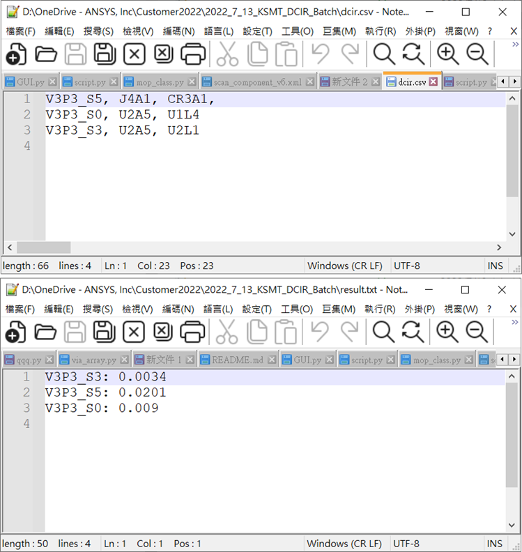

# 批次執行DCIR模擬

<figure><figcaption></figcaption></figure>

<details>

<summary>1_getNets.py</summary>


```python
# from win32com import client
# oApp = client.Dispatch("Ansoft.ElectronicsDesktop.2022.2")
# oDesktop = oApp.GetAppDesktop()
# oDesktop.RestoreWindow()
# AddWarningMessage = print

import re, os
os.chdir(os.path.dirname(__file__))

oProject = oDesktop.GetActiveProject()
oDesign = oProject.GetActiveDesign()
oEditor = oDesign.GetActiveEditor()

oDesktop.ClearMessages("", "", 2)

info = {}
for net in oEditor.GetNetClassNets('<Power/Ground>'):
    info[net] = []
    AddWarningMessage(net)
    
    for obj in oEditor.FindObjects('Net', net):
        if oEditor.GetPropertyValue('BaseElementTab', obj, 'Type') == 'Pin':            
            m = re.search('(.*?)-', obj)
            cmp = m.group(1)
            part_type = oEditor.GetPropertyValue('BaseElementTab', cmp, 'Part Type')
            
            if part_type in ['IC', 'IO', 'Other']:                
                if cmp not in info[net]:
                    info[net].append(cmp)

with open('./dcir.csv', 'w') as f:
    nets = sorted(info.keys())
    for net in nets:
        item = info[net]
        f.writelines('{}, {}\n'.format(net, ', '.join(item)))

csv_path = os.path.realpath('./dcir.csv')
AddWarningMessage("Export {} Successfully!".format(csv_path))
```


</details>

<details>

<summary>2_batch.py</summary>


```python
# from win32com import client
# oApp = client.Dispatch("Ansoft.ElectronicsDesktop.2022.2")
# oDesktop = oApp.GetAppDesktop()
# oDesktop.RestoreWindow()
# AddWarningMessage = print

import os
os.chdir(os.path.dirname(__file__))

oProject = oDesktop.GetActiveProject()
oDesign0 = oProject.GetActiveDesign()
design_name = oDesign0.GetName().split(';')[-1]
oEditor = oDesign0.GetActiveEditor()

oModule = oDesign0.GetModule("SolveSetups")
setups = oModule.GetSetups()
if len(setups) == 0:
    AddWarningMessage("Please add setup!")
else:
    setup = setups[0]

status = {}
with open("dcir.csv") as f:
    for line in f:
        try:
            data = line.split(',')
            net = data[0].strip()
            cmp = [i.strip() for i in data[1:3] if i.strip()]
            status[net] = cmp
        except:
            pass

pin_groups = oEditor.FindObjects('Type', 'pingroup')
if pin_groups:
    oEditor.Delete(pin_groups)
    
net_info = {}
for net in status:
    net_info[net] = {}
    for i in oEditor.FindObjects('Net', net):
        ctype = oEditor.GetPropertyValue('BaseElementTab', i, 'Type')
        if ctype == 'Pin':
            cmp, pin = i.split('-')
            if cmp not in net_info[net]:
                net_info[net][cmp] = [i]
            else:
                net_info[net][cmp] += [i]

for power_net in status:
    oProject.CopyDesign(design_name)
    oProject.Paste()
    oDesign = oProject.GetActiveDesign()
    oDesign.RenameDesignInstance(oDesign.GetName().split(';')[-1], '{}_{}'.format(design_name, power_net))
    oEditor = oDesign.GetActiveEditor()
    
    pin_groups_parameter = ["NAME:PinGroupDatas"]
    for cmp in status[power_net]:
        pin_groups_parameter.append(["NAME:{}_{}_Group".format(cmp, power_net)] + net_info[power_net][cmp])
                
    oEditor.CreatePinGroups(pin_groups_parameter)            

    pin_groups = list(oEditor.FindObjects('Type', 'pingroup'))
    group_port_parameter = ["NAME:elements"] + pin_groups
    group_port_parameter.append(["NAME:Boundary Types"] + ["DC Terminal"]*len(pin_groups))
    group_port_parameter.append(["NAME:Magnitudes"] + ["0"]*len(pin_groups))
    oEditor.CreatePinGroupPort(group_port_parameter)
                
    oDesign.Analyze(setup)
    oModule = oDesign.GetModule("ReportSetup")
    arr = oModule.GetSolutionDataPerVariation(  
    "Standard", 
    setup, 
    ["SimValueContext:=", [37010,0,2,0,False,False,-1,1,0,1,1,"",0,0,"DCIRID",False,"0","IDIID",False,"64"]],
    ["Index:=", ['All']], 
    ["PathRes({},{})".format(pin_groups[0], pin_groups[1])])
    
    res = arr[0].GetRealDataValues("PathRes({},{})".format(pin_groups[0], pin_groups[1]))[0]
    with open('result.txt', 'a') as f:
        f.writelines('{}: {}\n'.format(power_net, res))
    
    AddWarningMessage("Export {} Successfully!".format(os.path.realpath('result.txt')))
    
```


</details>

